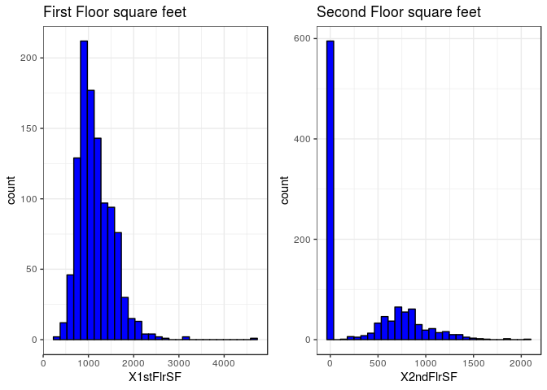
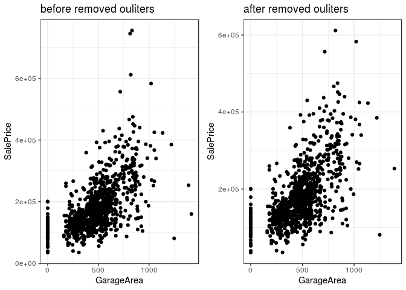
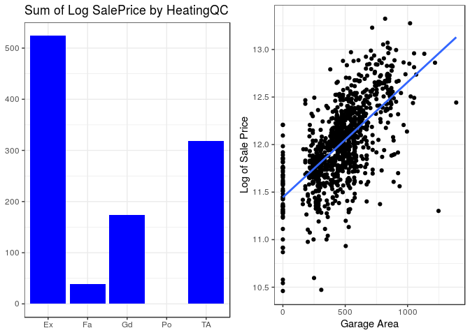
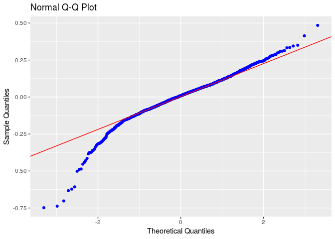
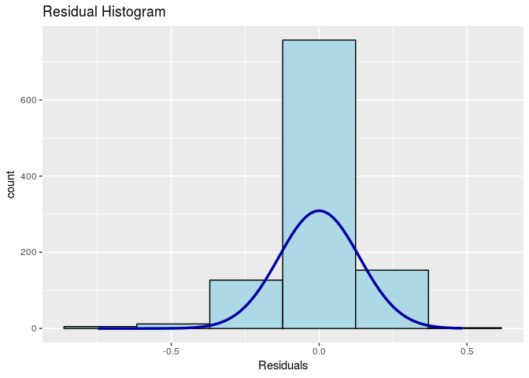
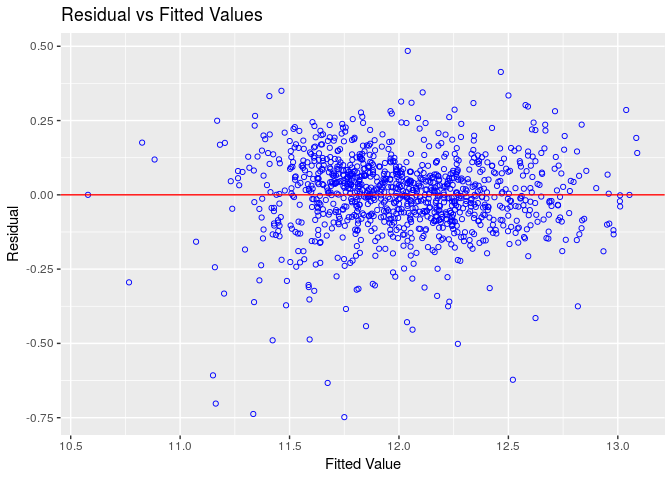
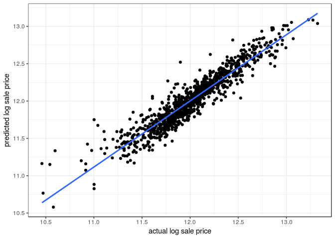

HOUSING PRICE: USING ADVANCED REGRESSION TECHNIQUES
================
JIANWEN WU

#### INTRODUCTION:

Housing has always been seen as one of the major stepping stones in
adulthood; people graduate college, get a job, start a family, and save
enough money to buy a house. The question though has always been how
much does it cost to buy a house and what factors into the price of a
house. In this project, we looked into dataset from 1460 houses bought
in Ames Iowa to create a regression model that best predicts the price
of a house in Ames, Iowa. The variable of interest that we study is
Sales Price and in our dataset we have eighty predictor variables that
are utilized to predict the cost of a house. Of the eighty predictors,
we have 23 nominal, 23 ordinal, 14 dis-crete, and 20 continuous and
these range from everything from Total Plot Area to Fire Place and Pool.
Our interest in this project is to select the most important variables
to study and create a model that best predicts the Sales Price of a
house. In evaluating our model, we will look into the bias of our model
to the actual sales price, the maximal deviation, mean iabsolute
deviation, and mean square error to conclude how accurately we created a
model to predict the Sales Price. We will use 1060 observations in our
training data set and compare our model to the 400 observations in the
test data set to see how our modeled Sales Price compares to the actual
Sales Price of the 400 observations.

From our dataset, we will look into normalizing the Sales Price by using
the log function, and we will convert some of our predictors into dummy
variables. From the list of variables, we will focus on several that we
believe are highly correlated with SalesPrice, and then variable
selection techniques also to see the maximum number of variables for
predicting a highly accurate model without overfitting the data. The
purpose is to create a model that can best predict the Sales Price from
our validation data set, but also that could be used on other data sets
and still get a good prediction.

#### DATA PREPROCESSING

Before we start to apply our regression model to the data set, it is
essential for us to have a clean and tide training data, the better
training data we can get, the better performance of our regression model
could behave. In data pre-processing we are mostly detecting and dealing
with missing values, handling outliers and replacing the values with the
median or most frequent value Treatment given to each variable is
described below.

  - Missing values in variables like PoolQC, MiscFeature, Alley, Fence,
    FireplaceQu, GarageType, GarageFinish, GarageQual, GarageCond,
    BsmtQual, BsmtCond, BsmtExposure, BsmtFinType1, BsmtFinType2,
    MasVnrType, MSSubClass are replaced by None based on data
    description.

  - Missing values in LotFrontage is replace by median of the data
    series.

  - Missing values in GarageYrBlt, GarageArea, GarageCars, BsmtFinSF1,
    BsmtFinSF2, BsmtUnfSF, To-talBsmtSF, BsmtFullBath, BsmtHalfBath,
    MasVnrArea are replaced with zero.

  - Electrical which denotes type of electrical sytem is replace by
    “SBrkr” because it was most frequent data val-ue in that series.

  - Rest all categorical variables are converted into factors.

#### DATA EXPLORATION

After data cleaning and transformation we began with some exploratory
analysis. A histogram plot shows the dis-tribution of the target
variable ‘SalePrice’ as being was right-skewed. So we decided to take
log of sale price in a way to obtain normal distribution for sale
price.

###### Transformation of Sale Price

<!-- -->

We also noticed that most of the variables are positively skewed so as
the sale price like 1stfloor surface area, sec-ond floor surface area,
BedroomabvGr (bedrooms above basement level), LotFrontage, OpenporchSF
etc.

<!-- -->

While data exploration we noticed that some features had outliers like
sale price was very huge for medium garage area. We have removed those
outliers from the data.

<!-- -->

#### VARIABLE SELECTION

When selecting our variables, we decided first to see which predictors
would someone who was buying a house choose. The ones that stood out
right away were Living Area, Bathroom, number of bedrooms, and total
rooms. When most people speak about houses, one of the first things they
mention is the number of bedrooms and bath-rooms so we assumed those
would be important factors in buying a house. For Living Area and total
Basement Square Footage, we knew we did not need to use the 1st and 2nd
floor breakdowns because they were added for total living area and total
basement square footage. Below graph shows comparison between log of
sale price and above the ground living area square feet. We can see some
strong pattern between
them.

<!-- -->

Next we included garage area and garage cars because of location, Iowa
is a state that most people drive in so there will be a need for cars.
Also, Iowa snows regularly, so an enclosed space, such as a garage,
would be very benefi-cial for whomever is buying the house. This factor
also made us include heating quality because Iowa is known to get very
cold in the
winters.

<!-- -->

###### CORRELATION PLOT

#### NEW VARIABLE CREATION AND TRANSFORMATION

The dataset contains rich information about all the factors which a home
buyer will consider while buying a house. We created new intuitive
variables to draw more meaningful insights.

  - Total number of bathrooms : we decided to create our own variable
    for bathrooms, by adding up basement half and full bathroom, and
    above ground half and full bathroom. The reason why we decided to
    create a new variable called total bathroom, was because we felt
    they each were important but we also just didn’t need four separate
    variables for bathroom.

  - Two categories for year of built: Year of built had many different
    years. We decided to split it into two variables, old and new. If a
    house was built before 1950, it was considered old and if it was
    built after 1950, we considered it new. The reason we chose 1950 was
    because when we compared year built with sales price, we saw a huge
    increase in sale price after 1950.

#### MODEL

Our final list of variables is as follows

  - GrLivArea(1st + 2nd SF): Above the ground living surface area.

  - GarageArea: Size of garage in square feet.

  - TotalBsmtSF(BSMT 1st + 2nd): Total square feet of basement area.

  - Total Bathroom: Add 4 bathroom variables up

  - GarageCars: Size of garage in car capacity.

  - TotRmsAbvGrd: Total rooms above the ground does not include bathroom

  - BedroomAbvGr: Number of bedrooms

  - YearBuilt(categorical): Divided this variable in two categories old
    and new based.

  - ExterQual(categorical): Exterior material quality

  - Neighborhood(categorical): Physical location

  - BldgType(categorical): Type of dwelling

  - OverallQual(categorical): Overall material and finish quality

  - HeatingQC(categorical) : Heating quality and condition

We decide to spilt categorical variables into dummy variables except the
predictor “OverallQual”. In total we had fourteen variables chosen, but
after making dummy variables, this number increased to 43.

#### MODEL DEVELOPMENT.

We developed a multiple linear regression model with all 43 variables.
The R Square is 0.8869 and adjust R Square is 0.8812.

The model was too complexity and was hard to explain. we perfomerd a
stepwise AIC forward regression on these 43 variables and reduced number
of variables to 27. The new model would be less complexity while
retained predictive power. The stepwise AIC forward regression will
iteratively adding variable to the model until the AIC would not be
decrease. In our case, the stepwise AIC forward regression stop at
variable \#27 ‘Neighborhood\_BrkSide’ with Adjust R Square 0.88176 (base
on the result below) .

    ## Forward Selection Method 
    ## ------------------------
    ## 
    ## Candidate Terms: 
    ## 
    ## 1 . GrLivArea 
    ## 2 . GarageArea 
    ## 3 . TotalBsmtSF 
    ## 4 . TotRmsAbvGrd 
    ## 5 . BedroomAbvGr 
    ## 6 . OverallQual 
    ## 7 . Total_Bathroom 
    ## 8 . YearBuilt_Old 
    ## 9 . ExterQual_Fa 
    ## 10 . ExterQual_Gd 
    ## 11 . ExterQual_TA 
    ## 12 . Neighborhood_Blueste 
    ## 13 . Neighborhood_BrDale 
    ## 14 . Neighborhood_BrkSide 
    ## 15 . Neighborhood_ClearCr 
    ## 16 . Neighborhood_CollgCr 
    ## 17 . Neighborhood_Crawfor 
    ## 18 . Neighborhood_Edwards 
    ## 19 . Neighborhood_Gilbert 
    ## 20 . Neighborhood_IDOTRR 
    ## 21 . Neighborhood_MeadowV 
    ## 22 . Neighborhood_Mitchel 
    ## 23 . Neighborhood_NAmes 
    ## 24 . Neighborhood_NoRidge 
    ## 25 . Neighborhood_NPkVill 
    ## 26 . Neighborhood_NridgHt 
    ## 27 . Neighborhood_NWAmes 
    ## 28 . Neighborhood_OldTown 
    ## 29 . Neighborhood_Sawyer 
    ## 30 . Neighborhood_SawyerW 
    ## 31 . Neighborhood_Somerst 
    ## 32 . Neighborhood_StoneBr 
    ## 33 . Neighborhood_SWISU 
    ## 34 . Neighborhood_Timber 
    ## 35 . Neighborhood_Veenker 
    ## 36 . BldgType_X2fmCon 
    ## 37 . BldgType_Duplex 
    ## 38 . BldgType_Twnhs 
    ## 39 . BldgType_TwnhsE 
    ## 40 . HeatingQC_Fa 
    ## 41 . HeatingQC_Gd 
    ## 42 . HeatingQC_Po 
    ## 43 . HeatingQC_TA 
    ## 
    ## 
    ## Variables Entered: 
    ## 
    ## - OverallQual 
    ## - GrLivArea 
    ## - YearBuilt_Old 
    ## - TotalBsmtSF 
    ## - GarageArea 
    ## - Total_Bathroom 
    ## - Neighborhood_Crawfor 
    ## - HeatingQC_TA 
    ## - BldgType_Twnhs 
    ## - BldgType_Duplex 
    ## - Neighborhood_IDOTRR 
    ## - Neighborhood_OldTown 
    ## - Neighborhood_ClearCr 
    ## - HeatingQC_Fa 
    ## - Neighborhood_BrDale 
    ## - Neighborhood_MeadowV 
    ## - Neighborhood_NridgHt 
    ## - Neighborhood_Veenker 
    ## - HeatingQC_Gd 
    ## - Neighborhood_Edwards 
    ## - ExterQual_Fa 
    ## - BldgType_TwnhsE 
    ## - BedroomAbvGr 
    ## - Neighborhood_StoneBr 
    ## - Neighborhood_Timber 
    ## - Neighborhood_Somerst 
    ## - Neighborhood_BrkSide 
    ## 
    ## No more variables to be added.

    ## 
    ##                               Selection Summary                                
    ## ------------------------------------------------------------------------------
    ## Variable                   AIC       Sum Sq      RSS       R-Sq      Adj. R-Sq 
    ## ------------------------------------------------------------------------------
    ## OverallQual               -74.830    114.769    56.411    0.67046      0.66762 
    ## GrLivArea                -411.480    130.246    40.935    0.76087      0.75858 
    ## YearBuilt_Old            -603.859    137.128    34.053    0.80107      0.79898 
    ## TotalBsmtSF              -718.366    140.685    30.496    0.82185      0.81980 
    ## GarageArea               -784.750    142.598    28.583    0.83302      0.83094 
    ## Total_Bathroom           -849.046    144.337    26.844    0.84318      0.84107 
    ## Neighborhood_Crawfor     -898.291    145.608    25.572    0.85061      0.84846 
    ## HeatingQC_TA             -945.601    146.775    24.406    0.85743      0.85523 
    ## BldgType_Twnhs           -973.257    147.451    23.730    0.86138      0.85910 
    ## BldgType_Duplex         -1002.696    148.147    23.034    0.86544      0.86311 
    ## Neighborhood_IDOTRR     -1024.945    148.670    22.511    0.86850      0.86608 
    ## Neighborhood_OldTown    -1050.180    149.243    21.938    0.87184      0.86937 
    ## Neighborhood_ClearCr    -1064.274    149.575    21.606    0.87378      0.87122 
    ## HeatingQC_Fa            -1076.788    149.870    21.311    0.87551      0.87285 
    ## Neighborhood_BrDale     -1088.642    150.148    21.033    0.87713      0.87439 
    ## Neighborhood_MeadowV    -1099.602    150.404    20.777    0.87863      0.87580 
    ## Neighborhood_NridgHt    -1106.464    150.578    20.603    0.87964      0.87672 
    ## Neighborhood_Veenker    -1112.356    150.731    20.450    0.88054      0.87752 
    ## HeatingQC_Gd            -1116.191    150.844    20.337    0.88120      0.87808 
    ## Neighborhood_Edwards    -1120.014    150.956    20.225    0.88185      0.87863 
    ## ExterQual_Fa            -1123.581    151.062    20.119    0.88247      0.87915 
    ## BldgType_TwnhsE         -1126.912    151.163    20.018    0.88306      0.87964 
    ## BedroomAbvGr            -1132.699    151.310    19.870    0.88392      0.88041 
    ## Neighborhood_StoneBr    -1136.787    151.425    19.756    0.88459      0.88098 
    ## Neighborhood_Timber     -1138.606    151.496    19.685    0.88501      0.88129 
    ## Neighborhood_Somerst    -1139.732    151.554    19.627    0.88534      0.88153 
    ## Neighborhood_BrkSide    -1140.862    151.612    19.569    0.88568      0.88176 
    ## ------------------------------------------------------------------------------

From the result above, we can see that the variable ‘OverallQual’ is
most important variable with R square 0.67046. A single variable
explained 67% of variance of the data\! Follow by “GrLivArea”,
“YearBuilt\_Old”, and so
on.

<!-- -->

In the plot above, we plotted all 27 variables that was chosen by
stepwise AIC forward regression corresponding to adjusted R square. The
plot shows as the number of variables increased, the adjust R-Squared
increased as well. we know that adjusted R-Squared is modified version
of R-squared that has been adjusted for the number of predictors in the
model, and it penalized number of predictors was added. In conclusion,
we decided to keep all 27
variables.

#### THE RESPONSE FUNCTION


|                           | Estimate  | Std. Error | t value | Pr(\>|t|) |
| :-----------------------: | :-------: | :--------: | :-----: | :-------: |
|      **(Intercept)**      |   10.73   |   0.149    |  71.99  |     0     |
|     **OverallQual2**      |  0.1014   |   0.1645   | 0.6164  |  0.5377   |
|     **OverallQual3**      |  0.3856   |   0.1503   |  2.565  |  0.01046  |
|     **OverallQual4**      |  0.4933   |   0.1485   |  3.321  | 0.0009277 |
|     **OverallQual5**      |   0.59    |   0.1489   |  3.963  | 7.913e-05 |
|     **OverallQual6**      |  0.6613   |   0.1491   |  4.435  | 1.022e-05 |
|     **OverallQual7**      |  0.7453   |   0.1497   |  4.979  | 7.485e-07 |
|     **OverallQual8**      |  0.8337   |   0.1509   |  5.527  | 4.145e-08 |
|     **OverallQual9**      |  0.9797   |   0.1532   |  6.395  | 2.437e-10 |
|     **OverallQual10**     |  0.9975   |   0.1597   |  6.248  | 6.109e-10 |
|       **GrLivArea**       | 0.000247  | 1.652e-05  |  14.95  | 7.292e-46 |
|    **YearBuilt\_Old**     | \-0.1066  |  0.01748   | \-6.095 | 1.55e-09  |
|      **TotalBsmtSF**      | 0.0001171 | 1.343e-05  |  8.719  | 1.125e-17 |
|      **GarageArea**       | 0.0002069 | 2.765e-05  |  7.484  | 1.559e-13 |
|    **Total\_Bathroom**    |  0.0602   |  0.006669  |  9.027  | 8.624e-19 |
| **Neighborhood\_Crawfor** |  0.1851   |  0.02549   |  7.263  | 7.511e-13 |
|     **HeatingQC\_TA**     | \-0.0742  |  0.01164   | \-6.373 | 2.807e-10 |
|    **BldgType\_Twnhs**    | \-0.1449  |  0.03064   | \-4.73  | 2.565e-06 |
|   **BldgType\_Duplex**    | \-0.1187  |  0.02278   | \-5.212 | 2.258e-07 |
| **Neighborhood\_IDOTRR**  | \-0.1622  |  0.03145   | \-5.157 | 3.015e-07 |
| **Neighborhood\_OldTown** | \-0.08257 |  0.02128   | \-3.881 | 0.0001108 |
| **Neighborhood\_ClearCr** |  0.1245   |  0.03154   |  3.947  | 8.44e-05  |
|     **HeatingQC\_Fa**     | \-0.1058  |  0.02493   | \-4.246 | 2.376e-05 |
| **Neighborhood\_BrDale**  | \-0.1592  |  0.04734   | \-3.362 | 0.0008012 |
| **Neighborhood\_MeadowV** | \-0.1075  |  0.04406   | \-2.439 |  0.0149   |
| **Neighborhood\_NridgHt** |  0.1014   |  0.02392   |  4.239  | 2.446e-05 |
| **Neighborhood\_Veenker** |  0.2062   |  0.07009   |  2.942  | 0.003333  |
|     **HeatingQC\_Gd**     | \-0.03576 |  0.01303   | \-2.745 | 0.006166  |
| **Neighborhood\_Edwards** | \-0.03334 |  0.01841   | \-1.811 |  0.07043  |
|     **ExterQual\_Fa**     | \-0.1066  |  0.04307   | \-2.475 |  0.01349  |
|   **BldgType\_TwnhsE**    | \-0.06654 |  0.01942   | \-3.427 | 0.0006356 |
|     **BedroomAbvGr**      | \-0.01939 |  0.007505  | \-2.583 | 0.009923  |
| **Neighborhood\_StoneBr** |  0.1272   |  0.04506   |  2.822  | 0.004859  |
| **Neighborhood\_Timber**  |  0.05862  |  0.02692   |  2.177  |  0.02969  |
| **Neighborhood\_Somerst** |  0.03764  |  0.02095   |  1.796  |  0.07272  |
| **Neighborhood\_BrkSide** |  0.04589  |  0.02637   |  1.74   |  0.08217  |

Fitting linear model: paste(response, “~”, paste(preds, collapse = " +
"))

We can see from the responded function that neighbourhood like StoneBr,
Timber, Brkside, Somrest shows a posi-tive relationship with sale price
whereas neighbor like meadow and Brdale shows negative relationship with
log sale price

### MODEL DIAGNOSTICS

We need to check the assumptions below.

Multiple Linear Regression Assumptions:

  - The errors has normal distribution
  - The errors has mean 0
  - Homoscedasticity of errors or equal variance
  - The errors are
independent.

###### Residual QQ plot and Residual Histogram

<!-- --><!-- -->

The QQ plot - The residual points roughly lie within the lines. The Q-Q
plot of the residuals suggests that the error terms are indeed normally
distributed.

The histogtram - The errors terms are indeed normally
distributed.

###### Residual vs Fitted Values Plot.

<!-- -->

  - The residuals spread randomly around the 0 line indicating that the
    relationship is linear.

  - The residuals roughly horizontal band around the 0 line indicating
    homogeneity of error variance.(constant variance)

  - No residuals are away from random pattern of residuals indicating no
    outliers.

###### Correlation between actual log sale price and predicted log sale price

<!-- -->

    ## [1] 0.941108

Based on the graph above, we can see that our model performed very good.
The correlation between acutal log sale price and predicted log sale
price is 0.94.

Ourvall, our model satisfied the linear regression assumptions.

### PREDICTION ON TEST SET

We are going to use the 4 metrics below to measure performance of our
model on the test dataset(using sale price). We transformed log sale
price back to sale price.

  - Bias
  - Maximum Deviation
  - Mean Absolute Deviation
  - Mean Square Error

|       measure        |   value   |
| :------------------: | :-------: |
|      test\_bias      |   751.8   |
|    test\_Max\_Dev    |   94781   |
| test\_Mean\_Abs\_Dev |   15563   |
| test\_Mean\_Sq\_Err  | 448613544 |

The table above is our model performance on test set.

``` r
#predicted_value %>%
# write.csv(predicted_value, "Predictied_Value.csv", na = "", row.names = F)
```
