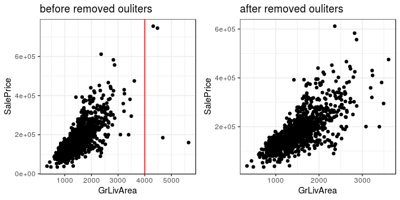
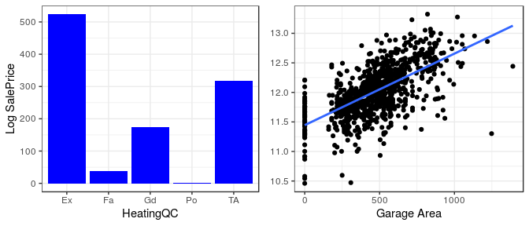
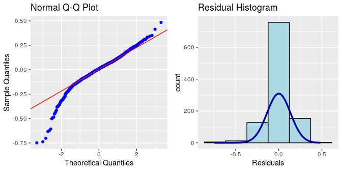
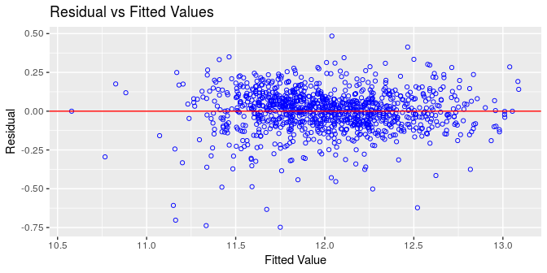
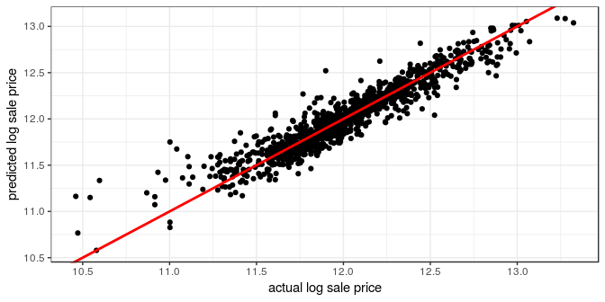
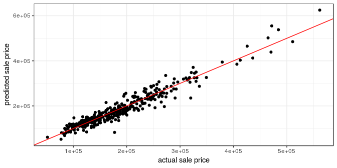

HOUSING PRICE: USING ADVANCED REGRESSION TECHNIQUES
================

### INTRODUCTION:

Housing has always been seen as one of the major stepping stones in
adulthood; people graduate college, get a job, start a family, and save
enough money to buy a house. The question though has always been how
much does it cost to buy a house and what factors into the price of a
house. In this project, we looked into data set from 1460 houses bought
in Ames Iowa to create a regression model that best predicts the price
of a house in Ames, Iowa. The variable of interest that we study is
Sales Price and in our data set we have eighty predictor variables that
are utilized to predict the cost of a house. Of the eighty predictors,
we have 23 nominal, 23 ordinal, 14 discrete, and 20 continuous and these
range from everything from Total Plot Area to Fire Place and Pool. Our
interest in this project is to select the most important variables to
study and create a model that best predicts the Sales Price of a house.
In evaluating our model, we will look into the bias of our model to the
actual sales price, the maximal deviation, mean absolute deviation, and
mean square error to conclude how accurately we created a model to
predict the Sales Price. We will use 1060 observations in our training
data set and compare our model to the 400 observations in the test data
set to see how our modeled Sales Price compares to the actual Sales
Price of the 400 observations.

From our data set, we will look into normalizing the Sales Price by
using the log function, and we will convert some of our predictors into
dummy variables. From the list of variables, we will focus on several
that we believe are highly correlated with SalePrice, and then variable
selection techniques also to see the maximum number of variables for
predicting a highly accurate model without overfitting the data. The
purpose is to create a model that can best predict the Sales Price from
our validation data set, but also that could be used on other data sets
and still get a good prediction.

### DATA PREPROCESSING

Before we start to apply our regression model to the data set, it is
essential for us to have a clean and tide training data, the better
training data we can get, the better performance of our regression model
could behave. In data pre-processing we are mostly detecting and dealing
with missing values, handling outliers and replacing the values with the
median or most frequent value Treatment given to each variable is
described below.

  - Missing values in variables like PoolQC, MiscFeature, Alley, Fence,
    FireplaceQu, GarageType, GarageFinish, GarageQual, GarageCond,
    BsmtQual, BsmtCond, BsmtExposure, BsmtFinType1, BsmtFinType2,
    MasVnrType, MSSubClass are replaced by None based on data
    description.

  - Missing values in LotFrontage is replace by the median LotFrontage
    of the neighborhood.

  - Missing values in GarageYrBlt, GarageArea, GarageCars, BsmtFinSF1,
    BsmtFinSF2, BsmtUnfSF, To-talBsmtSF, BsmtFullBath, BsmtHalfBath,
    MasVnrArea are replaced with zero.

  - Electrical which denotes type of electrical sytem is replace by
    “SBrkr” because it was most frequent data value in that series.

### DATA EXPLORATION

After data cleaning and transformation we began with some exploratory
analysis. A histogram plot shows the distribution of the target variable
“SalePrice” as being was right-skewed. So we decided to take log of sale
price in a way to obtain normal distribution for sale price.

#### Transformation of Sale Price

<!-- -->

While data exploration we noticed that the variable ‘GrLiveArea’ has
outlier.

<!-- -->

From the 1st graph above, we can see there are outliers at ‘GrLivArea’
greater than 4000. We decided to remove these outliers.

There might be more outliers in other variables, but removing all of
them might affect our model. such as less observation, and there might
be outliers in our test data as well. Therefore, we just removed the
outliers for variable “GrlivArea”.

### VARIABLE SELECTION

When selecting our variables, we decided first to see which predictors
would someone who was buying a house choose. The ones that stood out
right away were Living Area, Bathroom, number of bedrooms, and total
rooms. When most people speak about houses, one of the first things they
mention is the number of bedrooms and bathrooms so we assumed those
would be important factors in buying a house. For Living Area and total
Basement Square Footage, we knew we did not need to use the 1st and 2nd
floor breakdowns because they were added for total living area and total
basement square footage. Below graph shows comparison between log of
sale price and above the ground living area square feet. We can see some
strong pattern between
them.

<!-- -->

Next we included garage area and garage cars because of location, Iowa
is a state that most people drive in so there will be a need for cars.
Also, Iowa snows regularly, so an enclosed space, such as a garage,
would be very beneficial for whomever is buying the house. This factor
also made us include heating quality because Iowa is known to get very
cold in the winters.

<!-- -->

#### CORRELATION PLOT

<!-- -->

The above chart shows correlation plot between numerical variables and
log of sale price. We choose top 10 variables which had correlation
above 50 percent to reduce our total number of variables to enter into
the model.

### NEW VARIABLE CREATION AND TRANSFORMATION

The data set contains rich information about all the factors which a
home buyer will consider while buying a house. We created new intuitive
variables to draw more meaningful insights.

  - Total number of bathrooms : we decided to create our own variable
    for bathrooms, by adding up basement half and full bathroom, and
    above ground half and full bathroom. The reason why we decided to
    create a new variable called total bathroom, was because we felt
    they each were important but we also just didn’t need four separate
    variables for bathroom.

  - Two categories for year of built: Year of built had many different
    years. We decided to split it into two variables, old and new. If a
    house was built before 1950, it was considered old and if it was
    built after 1950, we considered it new. The reason we chose 1950 was
    because when we compared year built with sales price, we saw a huge
    increase in sale price after 1950.

### MODEL

Our final list of variables is as follows

  - GrLivArea(1st + 2nd SF): Above the ground living surface area.

  - GarageArea: Size of garage in square feet.

  - TotalBsmtSF(BSMT 1st + 2nd): Total square feet of basement area.

  - Total Bathroom: Add 4 bathroom variables up

  - GarageCars: Size of garage in car capacity.

  - TotRmsAbvGrd: Total rooms above the ground does not include bathroom

  - BedroomAbvGr: Number of bedrooms

  - YearBuilt(categorical): Divided this variable in two categories old
    and new based.

  - ExterQual(categorical): Exterior material quality

  - Neighborhood(categorical): Physical location

  - BldgType(categorical): Type of dwelling

  - OverallQual(categorical): Overall material and finish quality

  - HeatingQC(categorical) : Heating quality and condition

We decide to split categorical variables into dummy variables except the
predictor “OverallQual”. In total we had fourteen variables chosen, but
after making dummy variables, this number increased to 43.

#### MODEL DEVELOPMENT.

We fitted a multiple linear regression model with all 43 variables. The
R Square is 0.8869 and Adjust R Square is 0.8812.

The model was too complexity and was hard to explain. we performed a
stepwise AIC forward regression on these 43 variables and reduced number
of variables to 27. The new model would be less complexity while
retained predictive power. The stepwise AIC forward regression will
iteratively adding variable to the model until the AIC would not be
decrease. In our case, the stepwise AIC forward regression stop at
variable \#27 ‘Neighborhood\_BrkSide’ with Adjust R Square 0.88176 (base
on the result below) .

#### Below is the results of Stepwise AIC Forward Regression

    ## 
    ##                               Selection Summary                                
    ## ------------------------------------------------------------------------------
    ## Variable                   AIC       Sum Sq      RSS       R-Sq      Adj. R-Sq 
    ## ------------------------------------------------------------------------------
    ## OverallQual               -74.830    114.769    56.411    0.67046      0.66762 
    ## GrLivArea                -411.480    130.246    40.935    0.76087      0.75858 
    ## YearBuilt_Old            -603.859    137.128    34.053    0.80107      0.79898 
    ## TotalBsmtSF              -718.366    140.685    30.496    0.82185      0.81980 
    ## GarageArea               -784.750    142.598    28.583    0.83302      0.83094 
    ## Total_Bathroom           -849.046    144.337    26.844    0.84318      0.84107 
    ## Neighborhood_Crawfor     -898.291    145.608    25.572    0.85061      0.84846 
    ## HeatingQC_TA             -945.601    146.775    24.406    0.85743      0.85523 
    ## BldgType_Twnhs           -973.257    147.451    23.730    0.86138      0.85910 
    ## BldgType_Duplex         -1002.696    148.147    23.034    0.86544      0.86311 
    ## Neighborhood_IDOTRR     -1024.945    148.670    22.511    0.86850      0.86608 
    ## Neighborhood_OldTown    -1050.180    149.243    21.938    0.87184      0.86937 
    ## Neighborhood_ClearCr    -1064.274    149.575    21.606    0.87378      0.87122 
    ## HeatingQC_Fa            -1076.788    149.870    21.311    0.87551      0.87285 
    ## Neighborhood_BrDale     -1088.642    150.148    21.033    0.87713      0.87439 
    ## Neighborhood_MeadowV    -1099.602    150.404    20.777    0.87863      0.87580 
    ## Neighborhood_NridgHt    -1106.464    150.578    20.603    0.87964      0.87672 
    ## Neighborhood_Veenker    -1112.356    150.731    20.450    0.88054      0.87752 
    ## HeatingQC_Gd            -1116.191    150.844    20.337    0.88120      0.87808 
    ## Neighborhood_Edwards    -1120.014    150.956    20.225    0.88185      0.87863 
    ## ExterQual_Fa            -1123.581    151.062    20.119    0.88247      0.87915 
    ## BldgType_TwnhsE         -1126.912    151.163    20.018    0.88306      0.87964 
    ## BedroomAbvGr            -1132.699    151.310    19.870    0.88392      0.88041 
    ## Neighborhood_StoneBr    -1136.787    151.425    19.756    0.88459      0.88098 
    ## Neighborhood_Timber     -1138.606    151.496    19.685    0.88501      0.88129 
    ## Neighborhood_Somerst    -1139.732    151.554    19.627    0.88534      0.88153 
    ## Neighborhood_BrkSide    -1140.862    151.612    19.569    0.88568      0.88176 
    ## ------------------------------------------------------------------------------

From the result above, we can see that the variable ‘OverallQual’ is
most important variable with R square 0.67046. A single variable
explained 67% of variance of the data\! Follow by “GrLivArea”,
“YearBuilt\_Old”, and so on. With all 27 variables, the model
explained 88% of variances. Which is around same as the 43 variables
model.

<!-- -->

In the plot above, we plotted all 27 variables that was chosen by
stepwise AIC forward regression corresponding to adjusted R square. The
plot shows as the number of variables increased, the adjust R-Squared
increased as well. we know that adjusted R-Squared is modified version
of R-squared that has been adjusted for the number of predictors in the
model, and it penalized number of predictors was added. In conclusion,
we decided to keep all 27
variables.

### THE RESPONSE FUNCTION

|                           | Estimate  | Std. Error | t value | Pr(\>|t|) |
| :-----------------------: | :-------: | :--------: | :-----: | :-------: |
|      **(Intercept)**      |   10.73   |   0.149    |  71.99  |     0     |
|     **OverallQual2**      |  0.1014   |   0.1645   | 0.6164  |  0.5377   |
|     **OverallQual3**      |  0.3856   |   0.1503   |  2.565  |  0.01046  |
|     **OverallQual4**      |  0.4933   |   0.1485   |  3.321  | 0.0009277 |
|     **OverallQual5**      |   0.59    |   0.1489   |  3.963  | 7.913e-05 |
|     **OverallQual6**      |  0.6613   |   0.1491   |  4.435  | 1.022e-05 |
|     **OverallQual7**      |  0.7453   |   0.1497   |  4.979  | 7.485e-07 |
|     **OverallQual8**      |  0.8337   |   0.1509   |  5.527  | 4.145e-08 |
|     **OverallQual9**      |  0.9797   |   0.1532   |  6.395  | 2.437e-10 |
|     **OverallQual10**     |  0.9975   |   0.1597   |  6.248  | 6.109e-10 |
|       **GrLivArea**       | 0.000247  | 1.652e-05  |  14.95  | 7.292e-46 |
|    **YearBuilt\_Old**     | \-0.1066  |  0.01748   | \-6.095 | 1.55e-09  |
|      **TotalBsmtSF**      | 0.0001171 | 1.343e-05  |  8.719  | 1.125e-17 |
|      **GarageArea**       | 0.0002069 | 2.765e-05  |  7.484  | 1.559e-13 |
|    **Total\_Bathroom**    |  0.0602   |  0.006669  |  9.027  | 8.624e-19 |
| **Neighborhood\_Crawfor** |  0.1851   |  0.02549   |  7.263  | 7.511e-13 |
|     **HeatingQC\_TA**     | \-0.0742  |  0.01164   | \-6.373 | 2.807e-10 |
|    **BldgType\_Twnhs**    | \-0.1449  |  0.03064   | \-4.73  | 2.565e-06 |
|   **BldgType\_Duplex**    | \-0.1187  |  0.02278   | \-5.212 | 2.258e-07 |
| **Neighborhood\_IDOTRR**  | \-0.1622  |  0.03145   | \-5.157 | 3.015e-07 |
| **Neighborhood\_OldTown** | \-0.08257 |  0.02128   | \-3.881 | 0.0001108 |
| **Neighborhood\_ClearCr** |  0.1245   |  0.03154   |  3.947  | 8.44e-05  |
|     **HeatingQC\_Fa**     | \-0.1058  |  0.02493   | \-4.246 | 2.376e-05 |
| **Neighborhood\_BrDale**  | \-0.1592  |  0.04734   | \-3.362 | 0.0008012 |
| **Neighborhood\_MeadowV** | \-0.1075  |  0.04406   | \-2.439 |  0.0149   |
| **Neighborhood\_NridgHt** |  0.1014   |  0.02392   |  4.239  | 2.446e-05 |
| **Neighborhood\_Veenker** |  0.2062   |  0.07009   |  2.942  | 0.003333  |
|     **HeatingQC\_Gd**     | \-0.03576 |  0.01303   | \-2.745 | 0.006166  |
| **Neighborhood\_Edwards** | \-0.03334 |  0.01841   | \-1.811 |  0.07043  |
|     **ExterQual\_Fa**     | \-0.1066  |  0.04307   | \-2.475 |  0.01349  |
|   **BldgType\_TwnhsE**    | \-0.06654 |  0.01942   | \-3.427 | 0.0006356 |
|     **BedroomAbvGr**      | \-0.01939 |  0.007505  | \-2.583 | 0.009923  |
| **Neighborhood\_StoneBr** |  0.1272   |  0.04506   |  2.822  | 0.004859  |
| **Neighborhood\_Timber**  |  0.05862  |  0.02692   |  2.177  |  0.02969  |
| **Neighborhood\_Somerst** |  0.03764  |  0.02095   |  1.796  |  0.07272  |
| **Neighborhood\_BrkSide** |  0.04589  |  0.02637   |  1.74   |  0.08217  |

| Observations | Residual Std. Error | \(R^2\) | Adjusted \(R^2\) |
| :----------: | :-----------------: | :-----: | :--------------: |
|     1056     |       0.1385        | 0.8857  |      0.8818      |

Fitting linear model: paste(response, “~”, paste(preds, collapse = " +
"))

We can see from the responded function that neighbourhood like StoneBr,
Timber, Brkside, Somrest shows a posi-tive relationship with sale price
whereas neighbor like meadow and Brdale shows negative relationship with
log sale price. We have R Square of 0.8857 and adjust R Square 0.8818.

### MODEL DIAGNOSTICS

We need to check the assumptions below.

Multiple Linear Regression Assumptions:

  - The errors has normal distribution
  - The errors has mean 0
  - Homoscedasticity of errors or equal variance
  - The errors are independent.

#### Residual QQ plot and Residual Histogram

<!-- -->

The QQ plot - The residual points roughly lie within the lines. The Q-Q
plot of the residuals suggests that the error terms are indeed normally
distributed.

The histogram - The errors terms are indeed normally distributed.

#### Residual vs Fitted Values Plot.

<!-- -->

  - The residuals spread randomly around the 0 line indicating that the
    relationship is linear.

  - The residuals roughly horizontal band around the 0 line indicating
    homogeneity of error variance.(constant variance)

  - No residuals are away from random pattern of residuals indicating no
    outliers.

#### Correlation between actual log sale price and predicted log sale price on train data

<!-- -->

    ## [1] 0.941108

Based on the graph above, we can see that our model performed very good.
The correlation between actual log sale price and predicted log sale
price is 0.94.

Overall, our model satisfied the linear regression assumptions.

### PREDICTION ON TEST SET

We are going to use the 4 metrics below to measure performance of our
model on the test data set(using sale price). We transformed log sale
price back to sale price.

  - Bias
  - Maximum Deviation
  - Mean Absolute Deviation
  - Mean Square
Error

#### Correlation between actual sale price and predicted sale price on test data

<!-- -->

    ## [1] 0.9624428

From the plot above, we can see the actual sale price and predicted sale
price are highly correlated with correlation 0.96. In other words, our
model has very good prediction power on the test data set.

#### Table 1. The metrics on the full model with 44 variables

|          measure          |   value   |
| :-----------------------: | :-------: |
|           Bias            |   736.9   |
|    Maximum\_Deviation     |   93348   |
| Mean\_Absolute\_Deviation |   15192   |
|    Mean\_Square\_Error    | 433396722 |

#### Table 2. The metrics on the reduced model with 27 variables

|          measure          |   value   |
| :-----------------------: | :-------: |
|           Bias            |   751.8   |
|    Maximum\_Deviation     |   94781   |
| Mean\_Absolute\_Deviation |   15563   |
|    Mean\_Square\_Error    | 448613544 |

Table 1 and Table 2 are the performance metrics of full model(43
variables) and the reduced model(27 variables) on the test data set. We
can see that the full model has bias 736.9 and the reduced model has
bias 751.8. The reason is the full model has 44 variables and explained
more variances than the reduced model. The same idea apply for Mean
Square Error. In term of Maximum Deviation and Mean Absolute Deviation,
both model has similar metrics. Overall, we chose reduced model as our
final model. The performance metrics for both model are very closed, and
the reduced model are less complex.

### CONCLUSION

In conclusion, by running a linear model with our 27 variables, we found
that our adjusted R-square was .88176. We determined that the error
terms were normally distributed and that our relationship was linear,
which supported the choice of our model. We found a strong correlation
between actual log sale price and predicted log sale price. The model
performance on our test set is shown above and in the end we found a
good combination of numeric and categorical variables led to the best
prediction for Sales Price. Overall Quality was the most important
predictor, followed by Living Area and Year Built. These three variables
lay the foundation of buying a house, with many accessories after which
increase the Sales Price of a house after. There were many variables
that highly correlate with one another, which makes sense as people who
buy houses often look at similar qualities of houses when choosing.

In the end, there were a few variables that we also considered using
such as MS Zone and Sales Type which we thought could also also
influenced Sale Price, but they were either too difficult to interpret
or code to get the most out of the data so we did not include them. But
in the end of the day, these would also be more “accessories” than
foundations that would help explain the Sale Price of a house.

### CODE APPENDIX

``` r
library(recipes)
library(olsrr)
library(tidyverse)
library(pander)
library(recipes)
library(tidyverse)
library(stringr)
library(forcats)
library(tidyquant)
train_df <- read_csv("Data/training.csv")
test_df <- read_csv("Data/validation.csv")

data_process <- function(data, train = T, test = F, cor_df = F){
  
  #convert into factor
  df <- data %>%
      mutate(MSSubClass = as.factor(MSSubClass),
             OverallCond = as.factor(OverallCond),
             YrSold = as.factor(YrSold), 
             MoSold = as.factor(MoSold),
             OverallQual = as.factor(OverallQual))
  
  #fill NA's With None ----
  NA_cols_None <- c("PoolQC",
                    "MiscFeature",
                    "Alley",
                    "Fence",
                    "FireplaceQu",
                    "GarageType",
                    "GarageFinish",
                    "GarageQual",
                    "GarageCond",
                    "BsmtQual",
                    "BsmtCond",
                    "BsmtExposure",
                    "BsmtFinType1",
                    "BsmtFinType2",
                    "MasVnrType",
                    "MSSubClass")
  
  df[,NA_cols_None][is.na(df[,NA_cols_None])] <- "None"
  
  #fill NA's with median of LotFrontage of Neighborhood ----
  df <- df %>%
    group_by(Neighborhood) %>%
    mutate(LotFrontage = replace_na(LotFrontage, replace = median(LotFrontage, 
                                                                  na.rm = T))) %>%
    ungroup()
  
  
  #fill NA's with 0 ----
  NA_cols_0 <- (c(
    "GarageYrBlt",
    "GarageArea",
    "GarageCars",
    "BsmtFinSF1",
    "BsmtFinSF2",
    "BsmtUnfSF",
    "TotalBsmtSF",
    "BsmtFullBath",
    "BsmtHalfBath",
    "MasVnrArea"
  ))
  
  df[,NA_cols_0][is.na(df[,NA_cols_0])] <- 0
  
  #fill NA's with most frequently appear ----
  df <- df %>%
    mutate(Electrical = str_replace_na(string = Electrical, replacement = "SBrkr")) 
    
  if(train){
    
    return(
      
      df %>%
           #filter outlier ----  
           filter(GrLivArea < 4000) %>% 
        
        mutate(
          YearBuilt = ifelse(YearBuilt >= 1950, "New", "Old"),
      #Transform SalePrice into LogSalePrice ----
          Log_Sale_Price = log(SalePrice),
      #Create New Variable for TotalBathroom ----
          Total_Bathroom = BsmtFullBath + BsmtHalfBath + FullBath + HalfBath) %>%
        
        select(
          GrLivArea, GarageArea, TotalBsmtSF, TotRmsAbvGrd, BedroomAbvGr,
          YearBuilt, ExterQual, Neighborhood, BldgType, OverallQual, 
          HeatingQC, Total_Bathroom, Log_Sale_Price))
  }
  
  if(test){
    
    return(
      
      df %>%
        mutate(
          
          YearBuilt = ifelse(YearBuilt >= 1950, "New", "Old"),
      #Transform SalePrice into LogSalePrice ----
          Log_Sale_Price = log(SalePrice),
      #Create New Variable for TotalBathroom ----
          Total_Bathroom = BsmtFullBath + BsmtHalfBath + FullBath + HalfBath) %>%
        
        select(
          GrLivArea, GarageArea, TotalBsmtSF, TotRmsAbvGrd, BedroomAbvGr,
          YearBuilt, ExterQual, Neighborhood, BldgType, OverallQual, 
          HeatingQC, Total_Bathroom, Log_Sale_Price))
  }
  
  if(cor_df){
    
    return(
      df %>%
        mutate(Log_Sale_Price = log(SalePrice))
    )
  }
    
}

# run data_process function on train data
train_processed <- data_process(train_df,train = T)
plot_data <- data_process(train_df, train = F, test = F, cor_df = T)


#create dummy variables for all the nominal variables except variable "overallQual"
rec_obj <- recipe(Log_Sale_Price~., data = train_processed) %>%
  step_dummy(all_nominal(), -OverallQual) %>%
  prep()

#summary(rej_obj)

train_processed_model <- bake(rec_obj, new_data = train_processed)


p1_saleprice_Hist <- plot_data %>%
  ggplot(aes()) +
  geom_histogram(aes(SalePrice), fill = "blue", 
                 color = "black", bins = 30)  +
  theme_bw() +
  labs(y = NULL, x = "Sale Price")

#QQ plot of SalePrice

p1_saleprice_QQ  <- plot_data %>%
  ggplot(aes(sample = SalePrice)) +
  stat_qq() +
  stat_qq_line() + 
  theme_bw() +
  labs(y = "Sale Price")


#Histogram of log SalePrice

p2_log_saleprice_Hist <- plot_data %>%
  ggplot(aes()) +
  geom_histogram(aes(Log_Sale_Price), fill = "blue", 
                 color = "black", bins = 30)  +
  theme_bw() +
  labs(y = NULL, x = "Log Sale Price")

#QQ plot of log SalePrice

p2_log_saleprice_QQ  <- plot_data %>%
  ggplot(aes(sample = Log_Sale_Price)) +
  stat_qq() +
  stat_qq_line() + 
  theme_bw() +
  labs(y = "Log Sale Price")


cowplot::plot_grid(p1_saleprice_Hist, p1_saleprice_QQ,
                   p2_log_saleprice_Hist, p2_log_saleprice_QQ,
                   ncol = 2)

p1_outlier <- plot_data %>%
  ggplot(aes(GrLivArea, SalePrice)) +
  geom_point() +
  geom_vline(xintercept = 4000, color = "red") +
  theme_bw() +
  labs(title = "before removed ouliters") 


p2_outlier <- plot_data %>%
  filter(GrLivArea < 4000) %>%
  ggplot(aes(GrLivArea, SalePrice)) +
  geom_point() +
  theme_bw() +
  labs(title = "after removed ouliters") 

cowplot::plot_grid(p1_outlier, p2_outlier)

train_processed %>%
  ggplot(aes(GrLivArea, Log_Sale_Price)) +
  geom_point() +
  geom_smooth(se = F, method = "lm") +
  labs(x = "Above the ground living area square feet",
       y = "Log of Sale Price") +
  theme_bw()


p1 <- train_processed %>%
  ggplot(aes(HeatingQC)) +
  geom_bar(fill = 'blue') +
  labs(x = "HeatingQC", y = "Log SalePrice") +
  theme_bw()


p2 <- train_processed %>%
  ggplot(aes(GarageArea, Log_Sale_Price)) +
  geom_point() +
  geom_smooth(se = F, method = "lm") +
  labs(x = "Garage Area",
       y =  NULL) +
  theme_bw()

cowplot::plot_grid(p1,p2,label_x = "Log SalePrice")

get_cor <- function(data, target, use = "pairwise.complete.obs",
                    fct_reorder = FALSE, fct_rev = FALSE) {
    
    feature_expr <- enquo(target)
    feature_name <- quo_name(feature_expr)
    
    data_cor <- data %>%
        mutate_if(is.character, as.factor) %>%
        mutate_if(is.factor, as.numeric) %>%
        cor(use = use) %>%
        as_tibble() %>%
        mutate(feature = names(.)) %>%
        select(feature, !! feature_expr) %>%
        filter(!(feature == feature_name)) %>%
        mutate_if(is.character, as_factor)
    
    if (fct_reorder) {
        data_cor <- data_cor %>% 
            mutate(feature = fct_reorder(feature, !! feature_expr)) %>%
            arrange(feature)
    }
    
    if (fct_rev) {
        data_cor <- data_cor %>% 
            mutate(feature = fct_rev(feature)) %>%
            arrange(feature)
    }
    
    return(data_cor)
    
}

plot_cor <- function(data, target, fct_reorder = FALSE, fct_rev = FALSE, 
                     include_lbl = TRUE, lbl_precision = 2, lbl_position = "outward",
                     size = 2, line_size = 1, vert_size = 1, 
                     color_pos = palette_light()[[1]], 
                     color_neg = palette_light()[[2]]) {
    
    feature_expr <- enquo(target)
    feature_name <- quo_name(feature_expr)
    
    data_cor <- data %>%
        get_cor(!! feature_expr, fct_reorder = fct_reorder, fct_rev = fct_rev) %>%
        mutate(feature_name_text = round(!! feature_expr, lbl_precision)) %>%
        mutate(Correlation = case_when(
            (!! feature_expr) >= 0 ~ "Positive",
            TRUE                   ~ "Negative") %>% as.factor())
    
    g <- data_cor %>%
        ggplot(aes_string(x = feature_name, y = "feature", group = "feature")) +
        geom_point(aes(color = Correlation), size = size) +
        geom_segment(aes(xend = 0, yend = feature, color = Correlation), 
                     size = line_size) +
        geom_vline(xintercept = 0, color = palette_light()[[1]], size = vert_size) +
        expand_limits(x = c(-1, 1)) +
        theme_tq() +
        scale_color_manual(values = c(color_neg, color_pos)) 
    
    if (include_lbl) g <- g + geom_label(aes(label = feature_name_text), 
                                         hjust = lbl_position)
    
    return(g)
    
}


plot_data %>%
  select_if(is.numeric) %>%
  select(-SalePrice) %>%
  plot_cor(Log_Sale_Price,fct_reorder = T)
  
#linear fit on 43 variables
lm_fit <- lm(Log_Sale_Price ~., data = train_processed_model) 

summary(lm_fit)

#stepwise aic forward regression on 43 variables
lm_fw_aic <- ols_step_forward_aic(lm_fit)
lm_fw_aic
fd_df <- tibble(
  rank = c(seq(1,27,1)),
  predictor = lm_fw_aic$predictors, 
  adj_r2 = lm_fw_aic$arsq) 


#plot No. of Variables vs Adjust R2

fd_df %>%
  ggplot(aes(rank, adj_r2)) +
  geom_point() +
  geom_line() +
  labs(x = "Number of Variables", y = "Adjust R2") +
  scale_x_continuous(breaks = c(seq(1,27,1))) +
  theme_bw()

#response function for 27 variables selected from forward aic regression
lm_fw_aic$model %>%
  summary() %>%
  pander::pander()
#QQplot
p1_qq <- ols_plot_resid_qq(lm_fw_aic$model)

#Histogram
p2_hist <- ols_plot_resid_hist(lm_fw_aic$model)
#combine those qq and histogram together
cowplot::plot_grid(p1_qq, p2_hist)
#residual vs fitted value
ols_plot_resid_fit(lm_fw_aic$model)
# scatter plot of actual log sale price vs predicted log sale price
tibble(
  actual = train_processed_model$Log_Sale_Price,
  predicted = lm_fw_aic$model$fitted.values
) %>%
  ggplot(aes(actual, predicted)) +
  geom_point() +
  geom_abline(intercept = 0, slope = 1, color = "red", size = 1) +
  labs(x = "actual log sale price", y = "predicted log sale price") +
  theme_bw()

cor(train_processed_model$Log_Sale_Price, 
    lm_fw_aic$model$fitted.values)
bias <- function(Y_hat, Y){
  mean(Y_hat - Y)
}

Max_Dev <- function(Y_hat, Y){
  max(abs(Y_hat - Y))
}

Mean_Abs_Dev <- function(Y_hat, Y){
  mean(abs(Y_hat - Y))
}

Mean_sq_err <- function(Y_hat , Y){
  mean((Y_hat - Y)^2)
} 

test_processed <- data_process(test_df, train = F, test = T)
test_processed_model <- bake(rec_obj, new_data = test_processed)

# predction on log sale price
predicted_value_log <- lm_fw_aic$model %>%
  predict(test_processed_model)

# prediction on sale price
predicted_value <- exp(predicted_value_log)


y_hat_test_full_model = exp(lm_fit %>%
  predict(test_processed_model))


y_hat_test = predicted_value
y_test = test_df$SalePrice
tibble(
  actual = y_hat_test,
  predicted = y_test
) %>%
  ggplot(aes(actual, predicted)) +
  geom_point() +
  geom_abline(intercept = 0, slope = 1, color = "red") +
  labs(x = "actual sale price", y = "predicted sale price") +
  theme_bw()

cor(y_hat_test, 
    y_test)
#test performance on full model 
tibble(
  Bias = bias(y_hat_test_full_model, y_test),
  Maximum_Deviation = Max_Dev(y_hat_test_full_model, y_test),
  Mean_Absolute_Deviation = Mean_Abs_Dev(y_hat_test_full_model, y_test),
  Mean_Square_Error = Mean_sq_err(y_hat_test_full_model, y_test)
) %>%
  gather(key = "measure", value = "value") %>%
  pander::pander()
#test performance on reduced model 
tibble(
  Bias = bias(y_hat_test, y_test),
  Maximum_Deviation = Max_Dev(y_hat_test, y_test),
  Mean_Absolute_Deviation = Mean_Abs_Dev(y_hat_test, y_test),
  Mean_Square_Error = Mean_sq_err(y_hat_test, y_test)
) %>%
  gather(key = "measure", value = "value") %>%
  pander::pander()
```
